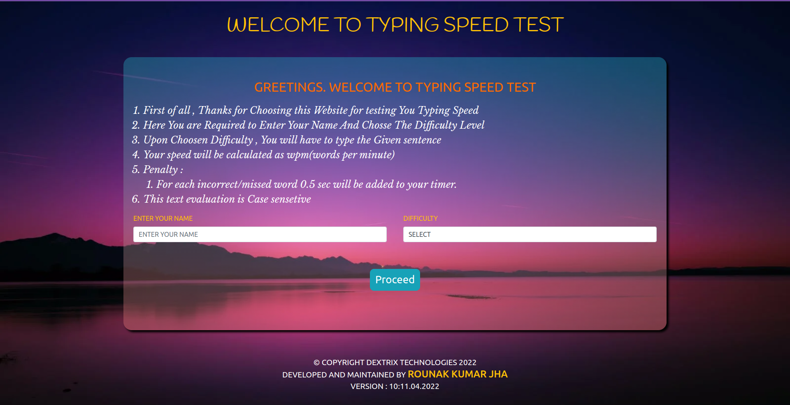
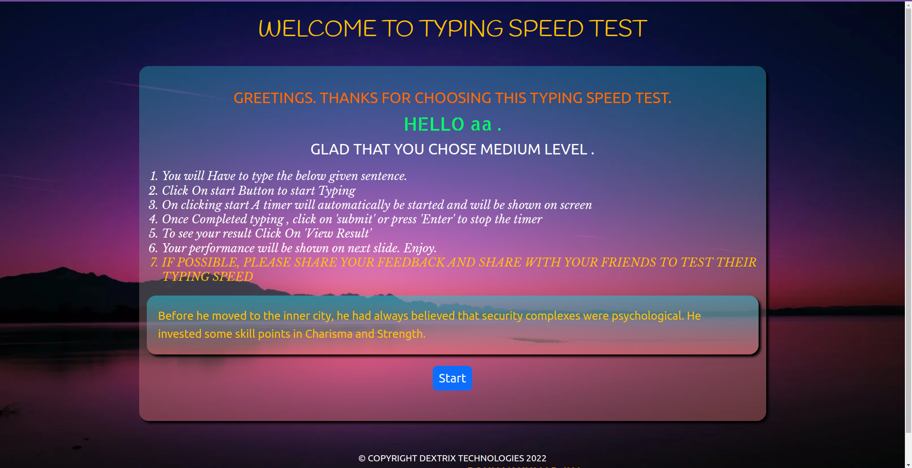
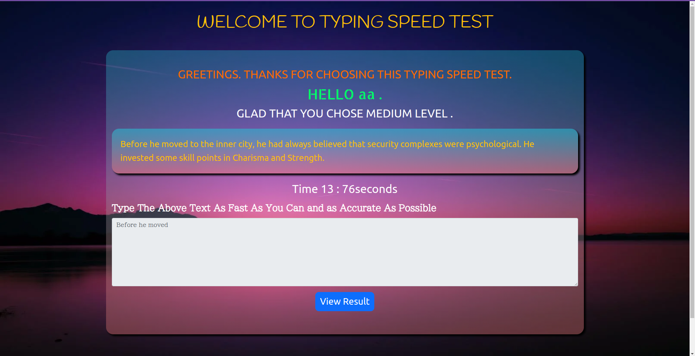
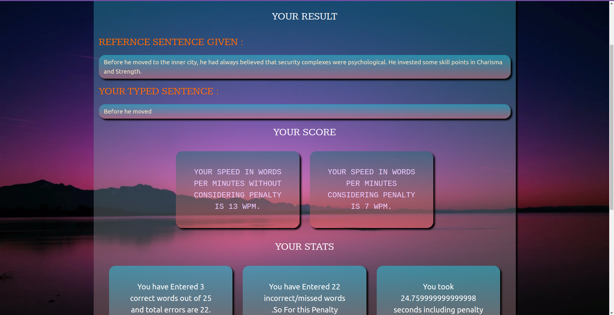

# Typing Speed Test Website 

# </img> </img>

## FRONTEND

# Home Page

# Sentence Reveal Page
 

# Typing Page
 

# Result Page

## Description

A basic Website for testing typing Speed. This is a Fully responsive site at all screen sizes.  

## Features

- Typing Speed test for 3 levels of difficulty.
- Website is responsive at all screen sizes.
- You can visit the website for reference purpose. [here](https://typing-test-rounak.netlify.app/) 

## Installation and Usage

- Read the [CONTRIBUTING.md](CONTRIBUTING.md) file.

- Clone this repository

- Run the live server

